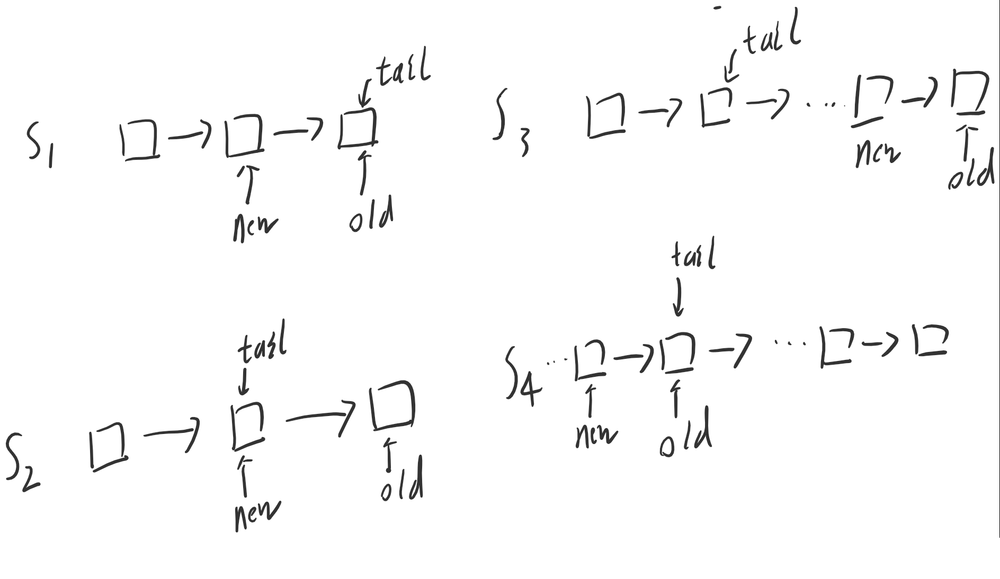

# lock-free 特性
一个“锁无关”的程序能够确保执行它的所有线程中至少有一个能够继续往下执行
## 参考链接
[http://www.cppblog.com/mysileng/archive/2014/09/03/208222.html](http://www.cppblog.com/mysileng/archive/2014/09/03/208222.html)
```C++
template <typename T>
class LockFreeQueue {
private:
  struct Node {
    Node( T val ) : value(val), next(nullptr) { }
    T value;
    Node* next;
  };
  Node* first;             // for producer only
  atomic<Node*> divider, last;         // shared

void Produce( const T& t ) {
  last->next = new Node(t);    // add the new item
      last  = last->next;      // publish it
  while( first != divider ) { // trim unused nodes
    Node* tmp = first;
    first = first->next;
    delete tmp;
  }
}


  bool Consume( T& result ) {
    if( divider != last ) {         // if queue is nonempty
      result = divider->next->value;  // C: copy it back
      divider = divider->next;   // D: publish that we took it
      return true;              // and report success
    }
    return false;               // else report empty
  }
};
```
# C++11
## 互斥锁
C++11中新增了<mutex>，它是C++标准程序库中的一个头文件，定义了C++11标准中的一些互斥访问的类与方法等。其中std::mutex就是lock、unlock。std::lock_guard与std::mutex配合使用，把锁放到lock_guard中时，mutex自动上锁，lock_guard析构时，同时把mutex解锁。mutex又称互斥量
1. std::mutex类
  - 该类表示普通的互斥锁, 不能递归使用
    ```C++
    #include <mutex>          // std::mutex
    std::mutex mtx;
    ```
2. std::timed_mutex
  - 该类表示定时互斥锁，不能递归使用。std::time_mutex比std::mutex多了两个成员函数
    1. try_lock_for()
    	函数参数表示一个时间范围，在这一段时间范围之内线程如果没有获得锁则保持阻塞；如果在此期间其他线程释放了锁，则该线程可获得该互斥锁；**如果超时(指定时间范围内没有获得锁)，则函数调用返回false**。

    2. try_lock_until()
    	函数参数表示一个时刻，在这一时刻之前线程如果没有获得锁则保持阻塞；如果在此时刻前其他线程释放了锁，则该线程可获得该互斥锁；**如果超过指定时刻没有获得锁，则函数调用返回false**

3. std::recursive_mutex
	- 该类表示递归互斥锁
		递归互斥锁可以被同一个线程多次加锁，以获得对互斥锁对象的多层所有权。例如，同一个线程多个函数访问临界区时都可以各自加锁，执行后各自解锁。**std::recursive_mutex释放互斥量时需要调用与该锁层次深度相同次数的unlock()，即lock()次数和unlock()次数相同**。可见，线程申请递归互斥锁时，**如果该递归互斥锁已经被当前调用线程锁住，则不会产生死锁**。此外，std::recursive_mutex的功能与 std::mutex大致相同。

4. std::recursive_timed_mutex

  - 带定时的递归互斥锁

互斥类的最重要成员函数是lock()和unlock()。在进入临界区时，执行lock()加锁操作，如果这时已经被其它线程锁住，则当前线程在此排队等待。退出临界区时，执行unlock()解锁操作。
​	
用于互斥锁的RAII的类模板：更好的办法是采用”资源分配时初始化”(RAII)方法来加锁、解锁，这避免了在临界区中因为抛出异常或return等操作导致没有解锁就退出的问题。极大地简化了程序员编写Mutex相关的异常处理代码。C++11的标准库中提供了std::lock_guard类模板做mutex的RAII
```C++
#include <mutex>

std::mutex mut;
 
{
       std::lock_guard<std::mutex> lk(mut);
}
 
{
       std::unqiue_lock<std::mutex> lk(mut);
}
```
std::unique_lock 与std::lock_guard都能实现自动加锁与解锁功能，但是std::unique_lock要比std::lock_guard更灵活，但是更灵活的代价是占用空间相对更大一点且相对更慢一点。

## 原子操作类 Atomic

### 参考链接
[https://www.cnblogs.com/haippy/archive/2013/09/05/3301408.html](https://www.cnblogs.com/haippy/archive/2013/09/05/3301408.html)
### 简单说明
它们提供的方法能保证具有原子性。这些方法是不可再分的，获取这些变量的值时，永远获得修改前的值或修改后的值，不会获得修改过程中的中间数值。

1. atomic_flag
  其实和atomic<bool>相似），它只有test_and_set()和clear()方法。其中，test_and_set会检查变量的值是否为false，如果为false则把值改为true。
2. atomic<T>
  - atomic<T>提供了常见且容易理解的方法
    1. store
      原子写操作

    2. load
      原子读操作

    3. exchange
      允许2个数值进行交换，并保证整个过程是原子的

    4. compare_exchange_weak
      CAS（compare and set）。参数会要求在这里传入期待的数值和新的数值。它们对比变量的值和期待的值是否一致，如果是，则替换为用户指定的一个新的数值。如果不是，则将变量的值和期待的值交换。

    5. compare_exchange_strong
  	weak版本的CAS允许偶然出乎意料的返回（比如在字段值和期待值一样的时候却返回了false），不过在一些循环算法中，这是可以接受的。通常它比起strong有更高的性能。
  - CAS的语义是“我认为V的值应该为A，如果是，那么将V的值更新为B，否则不修改并告诉V的值实际为多少”
  ```C++
  //DEMO
  #include <atomic>
  //------------------------------------------------------------
  std::atomic<int> aa(10);
  int aa1 = 10;
  aa.compare_exchange_weak(aa1, 11);//执行结果，aa:11, aa1:10,语句返回true
  //------------------------------------------------------------
  
  std::atomic<int> aa(10);
  int aa1 = 12;
  aa.compare_exchange_weak(aa1, 11);//执行结果，aa:10, aa1:10,语句返回false
  
  ```
  - 实现无锁对队列的例子
  ```C++
  #include <iostream>       // std::cout
  #include <atomic>         // std::atomic
  #include <thread>         // std::thread
  #include <vector>         // std::vector
  
  // a simple global linked list:
  struct Node { int value; Node* next; };
  std::atomic<Node*> list_head (nullptr);
  
  void append (int val) {     // append an element to the list
    Node* oldHead = list_head;
    Node* newNode = new Node {val,oldHead};
  
    // what follows is equivalent to: list_head = newNode, but in a thread-safe way:
    while (!list_head.compare_exchange_weak(oldHead,newNode)) {
      newNode->next = oldHead;
    }
  }
  void pop(int& val){
      Node* oldtail = list_tail;
      Node* newtail = odltail->front();
      
      while(!list_tail.compare_exchange_weak(oldtail,newtail)){
          newtail = oldtail->front();
      }
      list_tail->next = NULL;
      val = oldtail->val;
  }
  ```
  - 流程说明,任务出队
    
    1. S1 初始状态
    2. S2 抢占状态，抢占处理
    3. S3 被抢占状态
    4. S4 被抢占后处理

```flow
st=>start: 开始框

op0=>operation: S1
op1=>operation: S2
op2=>operation: S3
op3=>operation: S4

cond=>condition: 被其他线程处理(是或否?)

sub1=>subroutine: 子流程

io=>inputoutput: 输入输出框

e=>end: 结束框


st->op0->cond
cond(no)->op1->e
cond(yes)->op2->op3->op0
```

## 锁和CAS
- 锁
	1. 在多线程竞争下，加锁、释放锁会导致比较多的上下文切换和调度延时，引起性能问题。而且在上下文切换的时候，cpu之前缓存的指令和数据都将失效，对性能有很大的损失。用户态的锁虽然避免了这些问题，但是其实它们只是在没有真实的竞争时才有效。
	2. 一个线程持有锁会导致其它所有需要此锁的线程挂起直至该锁释放。
	3. 如果一个优先级高的线程等待一个优先级低的线程释放锁会导致导致优先级反转(Priority Inversion)，引起性能风险
- CAS
	1. 一个线程的失败或者挂起不应该影响其他线程的失败或挂起的算法。现代的CPU提供了特殊的指令，可以自动更新共享数据，而且能够检测到其他线程的干扰，而 compareAndSet() 就用这些代替了锁定
	2. ABA问题。比如说一个线程one从内存位置V中取出A，这时候另一个线程two也从内存中取出A，并且two进行了一些操作变成了B，然后two又将V位置的数据变成A，这时候线程one进行CAS操作发现内存中仍然是A，然后one操作成功。尽管线程one的CAS操作成功，但是不代表这个过程就是没有问题的。如果链表的头在变化了两次后恢复了原值，但是不代表链表就没有变化


```

```

## 条件变量std::condition_variable
- 参考链接  
		
- 头文件
	#include <condition_variable>  // std::condition_variable
	#include <mutex>               // std::mutex
### 成员函数

1. wait  
	wait是线程的等待动作，直到其它线程将其唤醒后，才会继续往下执行。下面通过伪代
	```C++
	std::mutex mutex;
	std::condition_variable cv;

	// 条件变量与临界区有关，用来获取和释放一个锁，因此通常会和mutex联用。
	std::unique_lock lock(mutex);
	// 此处会释放lock，然后在cv上等待，直到其它线程通过cv.notify_xxx来唤醒当前线程，cv被唤醒后会再次对lock进行上锁，然后wait函数才会返回。
	// wait返回后可以安全的使用mutex保护的临界区内的数据。此时mutex仍为上锁状态
	cv.wait(lock)
	```
	- 注意点  
		**wait有时会在没有任何线程调用notify的情况下返回**.这种情况就是有名的spurious wakeup。因此当wait返回时，你需要再次检查wait的前置条件是否满足，如果不满足则需要再次wait。wait提供了重载的版本，用于提供前置检查。
		```C++
		template <typename Predicate>
		void wait(unique_lock<mutex> &lock, Predicate pred) {
		    while(!pred()) {
			wait(lock);
		    }
		}
		```
		如果这个pred函数返回的是true，wait()函数不会阻塞会直接返回，如果这个函数返回的是false，wait()函数就会阻塞着等待唤醒，如果被伪唤醒，会继续判断函数返回值。
2. wait_for  
	等待指定时长
	```C++
	#include <chrono>
	cv.wait_for(lck,std::chrono::seconds(1);
	```
3. wait_until    
	等待到指定的时间

4. notify_one  
	唤醒等待的一个线程，注意只唤醒一个。
5. notify_all  
  唤醒所有等待的线程。使用该函数时应避免出现惊群效应。

  ```C++
  std::mutex mutex;
  std::condition_variable cv;
  
  std::unique_lock<std::mutex> lock(mutex);
  // 所有等待在cv变量上的线程都会被唤醒。但直到lock释放了mutex，被唤醒的线程才会从wait返回。
  cv.notify_all(lock)
  ```
