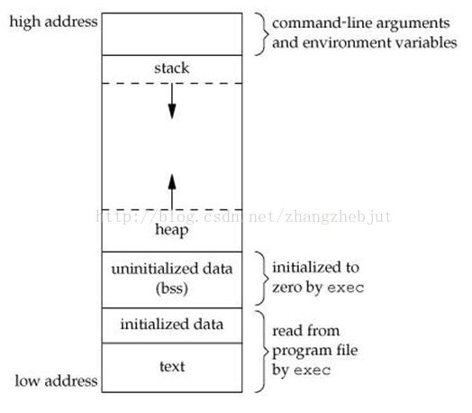

# 进程数据布局


- 程序段(Text):程序代码在内存中的映射，存放函数体的二进制代码 

- 初始化过的数据(Data):在程序运行初已经对变量进行初始化的数据。

- 未初始化过的数据(BSS):在程序运行初未对变量进行初始化的数据。

- 栈 (Stack):存储局部、临时变量，函数调用时，存储函数的返回指针，用于控制函数的调用和返回。在程序块开始时自动分配内存,结束时自动释放内存，其操作方式类似于数据结构中的栈。

- 堆 (Heap):存储动态内存分配,需要程序员手工分配,手工释放.注意它与数据结构中的堆是两回事，分配方式类似于链表。

- 高地址：命令行参数和全局环境变量
## 注意
1.Text, BSS, Data段在编译时已经决定了进程将占用多少VM 可以通过size，知道这些信息：
2.正常情况下，Linux进程不能对用来存放程序代码的内存区域执行写操作，即程序代码是以只读的方式加载到内存中，但它可以被多个进程安全的共享。
## ex


# 进程和信号

## 参考链接
[https://blog.csdn.net/qq3401247010/article/details/78279305](https://blog.csdn.net/qq3401247010/article/details/78279305)
## 进程基本属性
### 进程状态

## 信号
- ANSI C：这一标准是 ANSI（美国国家标准局）于 1989 年制定的 C 语言标准。 后来被 ISO（国际标准化组织）接受为标准，因此也称为 ISO C。
- POSIX：该标准最初由 IEEE 开发的标准族，部分已经被 ISO 接受为国际标准。

有两个信号可以停止进程:SIGTERM和SIGKILL。 SIGTERM比较友好，进程能捕捉这个信号，根据您的需要来关闭程序。在关闭程序之前，您可以结束打开的记录文件和完成正在做的任务。在某些情况下，假 如进程正在进行作业而且不能中断，那么进程可以忽略这个SIGTERM信号。

对于SIGKILL信号，进程是不能忽略的。这是一个 “我不管您在做什么,立刻停止”的信号。假如您发送SIGKILL信号给进程，Linux就将进程停止在那里
信号| 名字|  描述|进程行为
-|-|-
SIGHUP	|1	|Hangup (POSIX)；挂断|终止进程
SIGINT	|2	|Terminal interrupt (ANSI)；终端终端|终止进程
SIGQUIT|	3	|Terminal quit (POSIX)；终端退出|终止进程，并且生成core文件
SIGILL|	4	|Illegal instruction (ANSI)；非法指令|建立CORE文件
SIGTRAP|	5|	Trace trap (POSIX)；跟踪自陷|建立CORE文件
SIGIOT	|6|	IOT Trap (4.2 BSD)；执行I/O自陷|建立CORE文件
SIGBUS	|7	|BUS error (4.2 BSD)；总线错误|建立CORE文件
SIGFPE|	8	|Floating point exception (ANSI)；浮点异常|建立CORE文件
SIGKILL	|9	|Kill(can't be caught or ignored) (POSIX)；杀死进程|终止进程
SIGUSR1	|10	|User defined signal 1 (POSIX)；用户定义信号1|终止进程
SIGSEGV	|11	|Invalid memory segment access (ANSI)；段非法错误|建立CORE文件
SIGUSR2	|12|User defined signal 2 (POSIX)；用户定义信号2|终止进程
SIGPIPE	|13	|Write on a pipe with no reader, Broken pipe (POSIX)；向一个没有读进程的管道写数据|终止进程
SIGALRM	|14|Alarm clock (POSIX)；定时时钟|缺省的动作就是终止当前进程
SIGTERM	|15|Termination (ANSI)终止|进程终止
SIGSTKFLT	|16|Stack fault；协处理器堆栈错误|进程终止
SIGCHLD	|17|Child process has stopped or exited, changed (POSIX)；子进程结束时, 父进程会收到这个信号|忽略
SIGCONTv |18|Continue executing, if stopped (POSIX)；让一个停止(stopped)的进程继续执行|忽略，不能被阻塞
SIGSTOP	|19|	Stop executing(can't be caught or ignored) (POSIX)；停止一个进程|注意它和terminate以及interrupt的区别: 该进程还未结束, 只是暂停执行. 本信号不能被阻塞, 处理或忽略.
SIGTSTP	|20	|Terminal stop signal (POSIX);停止进程的运行|但该信号可以被处理和忽略. 用户键入SUSP字符时(通常是Ctrl-Z)发出这个信号
SIGTTIN	|21	|Background process trying to read, from TTY (POSIX);当后台作业要从用户终端读数据时, 该作业中的所有进程会收到SIGTTIN 信号|缺省时这些进程会停止执行
SIGTTOU	|22|Background process trying to write, to TTY (POSIX);写终端(或修改终端模式)时收到|缺省时这些进程会停止执行
SIGURG	|23|Urgent condition on socket (4.2 BSD);有"紧急"数据或out-of-band数据到达socket时产生|忽略
SIGXCPU	|24	|CPU limit exceeded (4.2 BSD); 超过CPU时间资源限制. 这个限制可以由getrlimit/setrlimit来读取/ 改变|建立CORE文件
SIGXFSZ	|25|File size limit exceeded (4.2 BSD);超过文件大小资源限制|建立CORE文件
SIGVTALRM	|26	|Virtual alarm clock (4.2 BSD);虚拟时钟信号. 类似于SIGALRM, 但是计算的是该进程占用的CPU时间.|进程退出
SIGPROF|27	|Profiling alarm clock (4.2 BSD)；类似于SIGALRM/SIGVTALRM, 但包括该进程用的CPU时间以及系统调用的时间|进程终止
SIGWINCH|	28	|Window size change (4.3 BSD, Sun)；窗口大小改变|忽略
SIGIO	|29|I/O now possible (4.2 BSD)；文件描述符准备就绪, 可以开始进行输入/输出操作.|进程终止
SIGPWR	|30|Power failure restart (System V)；电力故障|进程终止

# 父子进程的关系
## 概念
1. ppid表示某进程的父进程ID
2. pgid 进程组ID
## 对比
父子进程的相同之处：用户ID，宿主工作目录，工作目录，代码段、栈堆、环境变量等等。  
父子进程的不同之处：进程PID，PPID，fork返回值，进程运行时间，定时器。
父子进程间遵循**读时共享写时复制**的原则，这是为了节省内存。  
父子进程共享：文件描述符，mmap的映射区。
## fork
[https://www.cnblogs.com/chris-cp/p/3525070.html](https://www.cnblogs.com/chris-cp/p/3525070.html)

fork函数返回类型为pid_t，实质为unsigned int，而且有两次返回，一次返回子进程ID给父进程，一次返回0给子进程。
```C++
#include　<unistd.h>

#include <stdio.h>
#include <stdlib.h>
#include <errno.h>
#include <string.h>

char command[256];
int main()
{
    int rtn;
    printf(">>");
    
    fgets(command, 256, stdin);
    command[strlen(command)-1] = 0;
    if(fork()==0) //子进程
    {
        execlp(command, NULL);
        perror(command);
        exit(errno);
    }    
    else  //父进程
    {
        wait(&rtn);
        printf("child process return %d\n", rtn);
    }    
    
    return 0;
}
```

# 进程锁
参考链接
[https://blog.csdn.net/zyembed/article/details/79884211](https://blog.csdn.net/zyembed/article/details/79884211)
```C++

#include <stdio.h>
int main()
{
 
 
    HANDLE mutex;
    mutex = OpenMutex(MUTEX_ALL_ACCESS,FALSE,"memtest");
    if(mutex == NULL)
    {
        mutex = CreateMutex(NULL,FALSE,"memtest");
    }
    printf("0X%X\n",mutex);
    printf("0X%X\n",WaitForSingleObject(mutex,INFINITE));//测试返回码
    int x;
    while(scanf("%d",&x)!=EOF)
    {
        printf("x= %d\n",x);
        if(x == 10)
             break;
    }
    //ReleaseMutex(mutex);
    return 0;
}
```
## 线程锁转进程锁

进制间同步机制之mutex

1. Mutex锁可以用于进程间互斥？  当然可以。

a) 使用pthread_mutex_t 来实现进程间的互斥。

b) 当必须支持PTHREAD_PROCESS_SHARED属性

c)其中设置共享对象的属性为PTHREAD_PROCESS_SHARED是为了告诉系统该共享对象是跨越进程的，不仅仅对创建它的进程可见；但是仅有这一个条件显然无法满足不同进程使用该同步对象的需求，因为每个进程的地址空间是独立的，位于一个进程的普通内存区域中的对象是无法被其它进程所访问的，能满足这一要求的内存区域是共享内存，因而同步对象要在进程的共享内存区域内创建。
```C++

#include <pthread.h>
#include <sys/mman.h>
#include <unistd.h>
#include <sys/types.h>
#include <sys/wait.h>
 
int main()
{
        pthread_mutex_t  *pm_mutex = NULL;
        pthread_mutexattr_t mutex_shared_attr;
        int *p_shared = NULL;
        pid_t pid;
        //为什么要用mmap映射一个空间呢，因为mmap可以进程间共享内存
        pm_mutex = (pthread_mutex_t *)mmap(NULL, sizeof(pthread_mutex_t), PROT_READ | PROT_WRITE,
                                                MAP_SHARED | MAP_ANONYMOUS, -1, 0);
        p_shared = (int *)mmap(NULL, sizeof(int), PROT_READ | PROT_WRITE,
                                                MAP_SHARED | MAP_ANONYMOUS, -1, 0);
        *p_shared = 0;
 
        pthread_mutexattr_init(&mutex_shared_attr);
        pthread_mutexattr_setpshared(&mutex_shared_attr, PTHREAD_PROCESS_SHARED);
        pthread_mutex_init(pm_mutex, &mutex_shared_attr);
 
        pid = fork();
        if(pid ==0)
        {
                pthread_mutex_lock(pm_mutex);
                for (int i = 0; i< 5; i++)
                {
                        (*p_shared)++;
                        sleep(1);
                        printf("child process value is: %d\n", *p_shared);
                }
                pthread_mutex_unlock(pm_mutex);
                return 0;
        }else{
                pthread_mutex_lock(pm_mutex);
```
### 参考链接
[https://blog.csdn.net/zmxiangde_88/article/details/7998458](https://blog.csdn.net/zmxiangde_88/article/details/7998458)
[https://blog.csdn.net/weixin_42218802/article/details/80331984](https://blog.csdn.net/weixin_42218802/article/details/80331984)
## 文件锁
### flock, lockf, fcntl
首先flock和fcntl是系统调用，而lockf是库函数。lockf实际上是fcntl的封装，所以lockf和fcntl的底层实现是一样的，对文件加锁的效果也是一样的。后面分析不同点时大多数情况是将fcntl和lockf放在一起的。
[https://www.cnblogs.com/charlesblc/p/6287631.html](https://www.cnblogs.com/charlesblc/p/6287631.html)
### linux
1. 函数名  
  int flock(int fd,int operation);
2. 头文件  

   #include<sys/file.h>
3. 函数说明  
  flock()会依参数operation所指定的方式对参数fd所指的文件做各种锁定或解除锁定的动作。**此函数只能锁定整个文件，无法锁定文件的某一区域**
4. 参数 operation 说明  
  LOCK_SH 建立共享锁定。多个进程可同时对同一个文件作共享锁定。  
  LOCK_EX 建立互斥锁定。一个文件同时只有一个互斥锁定。  
  LOCK_UN 解除文件锁定状态。  
  LOCK_NB 无法建立锁定时，此操作可不被阻断，马上返回进程。通常与LOCK_SH或LOCK_EX 做OR(|)组合。  
5. 单一文件无法同时建立共享锁定和互斥锁定，而当使用dup()或fork()时文件描述词不会继承此种锁定。返回值  返回0表示成功，若有错误则返回-1，错误代码存于errno。
#### 使用
flock只要在打开文件后，需要对文件读写之前flock一下就可以了，用完之后再flock一下，前面加锁，后面解锁。  
一个进程去打开文件，输入一个整数，然后上一把写锁（LOCK＿EX），再输入一个整数将解锁（LOCK＿UN），另一个进程打开同样一个文件，直接向文件中写数据，发现锁不起作用，能正常写入（我此时用的是超级用户）。google了一大圈发现flock不提供锁检查，也就是说在用flock之前需要用户自己去检查一下是否已经上了锁，说明白点就是读写文件之前用一下flock检查一下文件有没有上锁，如果上锁了flock将会阻塞在那里(An attempt to lock the file using one of these file descriptors may be denied by a lock that the calling process has already placed via another descriptor )，除非用了LOCK_NB。
```C++
#include <stdio.h>
#include <unistd.h>
#include <sys/types.h>
#include <sys/stat.h>
#include <fcntl.h>
#include <errno.h>


int fd,i;
char path[]="/home/taoyong/test.txt";
extern int errno;
fd=open(path,O_WRONLY|O_CREAT);
if(fd!=-1)
{
   if(flock(fd,LOCK_EX)==0)
   {
     printf("the file was locked./n");
   }else
   {
     printf("the file was not locked./n");
   }
   
    if(flock(fd,LOCK_UN)==0)
    {
      printf("the file was unlocked./n");
    }else
    {
      printf("the file was not unlocked./n");
    }
     close(fd);
}
//---------------------------------
   int fd,i;
    char path[]="/home/taoyong/test.txt";
    char s[]="writing.../nwriting....../n";
    extern int errno;
    fd=open(path,O_WRONLY|O_CREAT|O_APPEND);
    if(fd!=-1)
            {
        printf("open file %s ./n",path);

            if(flock(fd,LOCK_EX|LOCK_NB)==0)
            {
            printf("the file was locked by the process./n");    
                if(-1!=write(fd,s,sizeof(s)))
                    {
                printf("write %s to the file %s/n",s,path);
                        }
                else
                       {
                printf("cannot write the file %s/n",path);
                printf("errno:%d/n",errno);
                printf("errMsg:%s/n",strerror(errno));
                    }        
                
            }
        else
            {
            printf("the file was locked by other process.Can't write.../n");
                printf("errno:%d:",errno);
            }
        
        close(fd);


            }
        else
           {
        printf("cannot open file %s/n",path);
        printf("errno:%d/n",errno);
        printf("errMsg:%s",strerror(errno));
            }

```
## windows
```C++
BOOL WINAPI LockFile(
_In_ HANDLE hFile,
_In_ DWORD dwFileOffsetLow,
_In_ DWORD dwFileOffsetHigh,
_In_ DWORD nNumberOfBytesToLockLow,
_In_ DWORD nNumberOfBytesToLockHigh
);
```


# 进程间通信
## 信息量
## 管道
## 共享内存
### mmap系统调用
mmap将一个文件或者其它对象映射进内存。文件被映射到多个页上，如果文件的大小不是所有页的大小之和，最后一个页不被使用的空间将会清零。munmap执行相反的操作，删除特定地址区域的对象映射。
#### 参考链接
[https://www.cnblogs.com/xiaocry/p/5529712.html](https://www.cnblogs.com/xiaocry/p/5529712.html)
```C++
#include <sys/mman.h>
void *mmap(void *start, size_t length, int prot, int flags,int fd, off_t offset);
//start：映射区的开始地址。

//length：映射区的长度。

//prot：期望的内存保护标志，不能与文件的打开模式冲突。是以下的某个值，可以通过or运算合理地组合在一起。
//PROT_EXEC //页内容可以被执行

//PROT_READ //页内容可以被读取

//PROT_WRITE //页可以被写入

//PROT_NONE //页不可访问

//flags：指定映射对象的类型，映射选项和映射页是否可以共享。它的值可以是一个或者多个以下位的组合体
/*
MAP_FIXED //使用指定的映射起始地址，如果由start和len参数指定的内存区重叠于现存的映射空间，重叠部分将会被丢弃。如果指定的起始地址不可用，操作将会失败。并且起始地址必须落在页的边界上。

MAP_SHARED //与其它所有映射这个对象的进程共享映射空间。对共享区的写入，相当于输出到文件。直到msync()或者munmap()被调用，文件实际上不会被更新。

MAP_PRIVATE //建立一个写入时拷贝的私有映射。内存区域的写入不会影响到原文件。这个标志和以上标志是互斥的，只能使用其中一个。

MAP_DENYWRITE //这个标志被忽略。

MAP_EXECUTABLE //同上

MAP_NORESERVE //不要为这个映射保留交换空间。当交换空间被保留，对映射区修改的可能会得到保证。当交换空间不被保留，同时内存不足，对映射区的修改会引起段违例信号。

MAP_LOCKED //锁定映射区的页面，从而防止页面被交换出内存。

MAP_GROWSDOWN //用于堆栈，告诉内核VM系统，映射区可以向下扩展。

MAP_ANONYMOUS //匿名映射，映射区不与任何文件关联。

MAP_ANON //MAP_ANONYMOUS的别称，不再被使用。

MAP_FILE //兼容标志，被忽略。

MAP_32BIT //将映射区放在进程地址空间的低2GB，MAP_FIXED指定时会被忽略。当前这个标志只在x86-64平台上得到支持。

MAP_POPULATE //为文件映射通过预读的方式准备好页表。随后对映射区的访问不会被页违例阻塞。

MAP_NONBLOCK //仅和MAP_POPULATE一起使用时才有意义。不执行预读，只为已存在于内存中的页面建立页表入口。
*/
//fd：有效的文件描述词。如果MAP_ANONYMOUS被设定，为了兼容问题，其值应为-1。

//offset：被映射对象内容的起点。
```
成功执行时，mmap()返回被映射区的指针.失败时，mmap()返回MAP_FAILED其值为-1
#### errno被设为以下的某个值

EACCES：访问出错

EAGAIN：文件已被锁定，或者太多的内存已被锁定

EBADF：fd不是有效的文件描述词

EINVAL：一个或者多个参数无效

ENFILE：已达到系统对打开文件的限制

ENODEV：指定文件所在的文件系统不支持内存映射

ENOMEM：内存不足，或者进程已超出最大内存映射数量

EPERM：权能不足，操作不允许

ETXTBSY：已写的方式打开文件，同时指定MAP_DENYWRITE标志

SIGSEGV：试着向只读区写入

SIGBUS：试着访问不属于进程的内存区

### munmap
```C++
#include <sys/mman.h>
int munmap(void *start, size_t length);
//该调用在进程地址空间中解除一个映射关系，addr是调用mmap()时返回的地址，len是映射区的大小。当映射关系解除后，对原来映射地址的访问将导致段错误发生。 
```
成功munmap()返回0.失败munmap返回-1。errno被设为以下的某个值

### 系统调用msync()
int msync ( void * addr , size_t len, int flags)   
一般说来，进程在映射空间的对共享内容的改变并不直接写回到磁盘文件中，往往在调用munmap（）后才执行该操作。可以通过调用msync()实现磁盘上文件内容与共享内存区的内容一致。
### 系统调用mmap()用于共享内存的两种方式：
1. 使用普通文件提供的内存映射：适用于任何进程之间；此时，需要打开或创建一个文件，然后再调用mmap()；典型调用代码如下： 
```C++
fd=open(name, flag, mode);
if(fd<0)
...
ptr=mmap(NULL, len , PROT_READ|PROT_WRITE, MAP_SHARED , fd , 0);
```
2. 使用特殊文件提供匿名内存映射：适用于具有亲缘关系的进程之间；由于父子进程特殊的亲缘关系，在父进程中先调用mmap()，然后调用fork()。那么在调用fork()之后，子进程继承父进程匿名映射后的地址空间，同样也继承mmap()返回的地址，这样，父子进程就可以通过映射区域进行通信了。注意，这里不是一般的继承关系。一般来说，子进程单独维护从父进程继承下来的一些变量。而mmap()返回的地址，却由父子进程共同维护。 
对于具有亲缘关系的进程实现共享内存最好的方式应该是采用匿名内存映射的方式。此时，不必指定具体的文件，只要设置相应的标志即可.

### 原理
1. 在用户虚拟地址空间中寻找空闲的满足要求的一段连续的虚拟地址空间,为映射做准备(由内核mmap系统调用完成)
2. 建立虚拟地址空间和文件或设备的物理地址之间的映射(设备驱动完成)
