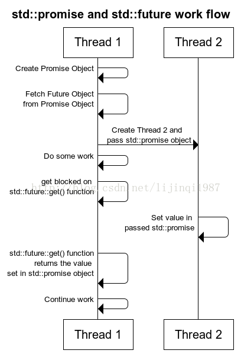

# 基础知识
- 线程是执行指令的单元

## C++ 线程知识
### 使用
```C++
#include <iostream>
#include <thread>

using namespace std;

void output(int i)
{
    cout << i << endl;
}

int main()
{
    
    for (uint8_t i = 0; i < 4; i++)
    {
        thread t(output, i);
        t.detach(); 
    }
        
    getchar();
    return 0;
}
```
#### 注意事项
1. **异常情况下等待线程完成**
当决定以detach方式让线程在后台运行时，可以在创建thread的实例后立即调用detach，这样线程就会后thread的实例分离，即使出现了异常thread的实例被销毁，仍然能保证线程在后台运行。但线程以join方式运行时，需要在主线程的合适位置调用join方法，如果调用join前出现了异常，thread被销毁，线程就会被异常所终结。为了避免异常将线程终结，或者由于某些原因，例如线程访问了局部变量，就要保证线程一定要在函数退出前完成，就要保证要在函数退出前调用join
2. **转移线程的所有权**
thread是可移动的(movable)的，但不可复制(copyable)。可以通过move来改变线程的所有权，灵活的决定线程在什么时候join或者detach
```C++
thread t1(f1);
thread t3(move(t1));
```
将线程从t1转移给t3,这时候t1就不再拥有线程的所有权，调用t1.join或t1.detach会出现异常，要使用t3来管理线程。这也就意味着thread可以作为函数的返回类型，或者作为参数传递给函数，能够更为方便的管理线程。

3. **线程的标识类型为std::thread::id**，有两种方式获得到线程的id。

- 通过thread的实例调用get_id()直接获取

- 在当前线程上调用this_thread::get_id()获取

## 异步使用c++11

### std::async
- 定义
而std::async比std::promise, std::packaged_task和std::thread更高一层，它可以直接用来创建异步的task，异步任务返回的结果也保存在future中。std::async的原型：
```C++
std::future<typename std::result_of<Function(Args...)>::type> = async( std::launch policy, Function&& f, Args&&... args );
```
std::launch policy有两个，
​    1. （std::launch::async），调用即创建线程，std::launch::async当返回的future失效前会强制执行task，即不调用future.get也会保证task的执行
​    2. （std::launch::deferred），**延迟加载方式创建线程，当掉使用async时不创建线程，直到调用了future的get或者wait时才创建线程**。
f:线程函数  
args:线程参数。

### 注意点
注意第三条：在以下三个条件全部满足时future析构可能阻塞

（1）共享状态是由调用std::async时创建的

（2）共享状态还不是ready状态

（3）被析构的当前对象持有着对共享状态的最后一个引用
可以使用std::packaged_task和std::thread避免这个问题
### demo
```C++
#include "stdafx.h"
#include <iostream>
#include <future>
#include <thread>

int main()
{
    // future from a packaged_task
    std::packaged_task<int()> task([]() { 
        std::cout << "packaged_task started" << std::endl;
        return 7; }); // wrap the function
    std::future<int> f1 = task.get_future();  // get a future
    std::thread(std::move(task)).detach(); // launch on a thread

                                           // future from an async()
    std::future<int> f2 = std::async(std::launch::deferred, []() { 
        std::cout << "Async task started" << std::endl;
        return 8; });

    // future from a promise
    std::promise<int> p;
    std::future<int> f3 = p.get_future();
    std::thread([&p] { p.set_value_at_thread_exit(9); }).detach();

    f1.wait();
    f2.wait();
    f3.wait();
    std::cout << "Done!\nResults are: "
        << f1.get() << ' ' << f2.get() << ' ' << f3.get() << '\n';
}

```

### std::future
- 定义
std::future是一个类模板(class template)，其对象存储未来的值
- 原理
事实上，一个std::future对象在内部存储一个将来会被赋值的值，并提供了一个访问该值的机制，通过get()成员函数实现。但如果有人试图在get()函数可用之前通过它来访问相关的值，那么get()函数将会阻塞，直到该值可用。
future_status有三种状态：

	- deferred：异步操作还没开始
	- ready：异步操作已经完成
	- timeout：异步操作超时
	```C++
	//查询future的状态
std::future_status status;
    do {
        status = future.wait_for(std::chrono::seconds(1));
        if (status == std::future_status::deferred) {
            std::cout << "deferred\n";
        } else if (status == std::future_status::timeout) {
            std::cout << "timeout\n";
        } else if (status == std::future_status::ready) {
            std::cout << "ready!\n";
        }
    } while (status != std::future_status::ready); 
	```
	获取future结果有三种方式：get、wait、wait_for，其中get等待异步操作结束并返回结果，wait只是等待异步操作完成，没有返回值，wait_for是超时等待返回结果
### std::promise
- 定义
  也是一个类模板，其对象有可能在将来对值进行赋值

- 原理
  每个std::promise对象有一个对应的std::future对象，一旦由std::promise对象设置，std::future将会对其赋值。并且**std::promise对象与其管理的std::future对象共享数据**
### demo
```C++
#include <future>       // std::packaged_task, std::future
std::promise<int> promiseObj;
/*目前为止，该promise对象没有任何管理的值，但它承诺肯定会有人对其进行赋值，一旦被赋值，就可以通过其管理的std::future对象来获取该值。
但是，假设线程1创建了该promise对象并将其传给线程2，那么线程1怎样知道线程2什么时候会对promise对象进行赋值呢？
答案是使用std::future对象
每个std::promise对象都有个对应的std::future对象，其他人可以通过它来获取promise设置的值。
所以，线程1将会创建std::promise对象，然后在将其传递给线程2之前从它那里获取std::future对象
*/
std::future<int> futureObj = promiseObj.get_future();
/*现在，线程1将promiseObj传递给线程2.
那么线程1将会获取到线程2通过std::future的get函数设置在std::promise中的值，*/
int val = futureObj.get();
/*但是如果线程2还没有对该值进行设置，那么这个调用将会阻塞，直到线程2在promise对象中对该值进行设置。*/
promiseObj.set_value(45);
```
- **完整流程如图：**



#### 注意点
如果std::promise对象在赋值之前被销毁，那么管理的std::future对象上的get()调用将会抛出异常。
除此之外，如果想要线程在不同时间点返回多个值，只需要在线程中传输多个std::promise对象，并从相关的多个std::futur对象中获取多个返回值

### std::packaged_task

- 定义
std::packaged_task 包装一个可调用的对象，并且允许异步获取该可调用对象产生的结果
- 原理
std::packaged_task 与 std::function 类似，只不过 std::packaged_task 将其包装的可调用对象的执行结果传递给一个 std::future 对象（该对象通常在另外一个线程中获取 std::packaged_task 任务的执行结果）
std::packaged_task 对象内部包含了两个最基本元素，一、被包装的任务(stored task)，任务(task)是一个可调用的对象，如函数指针、成员函数指针或者函数对象，二、共享状态(shared state)，用于保存任务的返回值，可以通过 std::future 对象来达到异步访问共享状态的效果

#### demo

```C++
#include <iostream>     // std::cout
#include <future>       // std::packaged_task, std::future
#include <chrono>       // std::chrono::seconds
#include <thread>       // std::thread, std::this_thread::sleep_for

// count down taking a second for each value:
int countdown (int from, int to) {
    for (int i=from; i!=to; --i) {
        std::cout << i << '\n';
        std::this_thread::sleep_for(std::chrono::seconds(1));
    }
    std::cout << "Finished!\n";
    return from - to;
}

int main ()
{
    std::packaged_task<int(int,int)> task(countdown); // 设置 packaged_task
    std::future<int> ret = task.get_future(); // 获得与 packaged_task 共享状态相关联的 future 对象.

    std::thread th(std::move(task), 10, 0);   //创建一个新线程完成计数任务.

    int value = ret.get();                    // 等待任务完成并获取结果.

    std::cout << "The countdown lasted for " << value << " seconds.\n";

    th.join();
    return 0;
}
```

